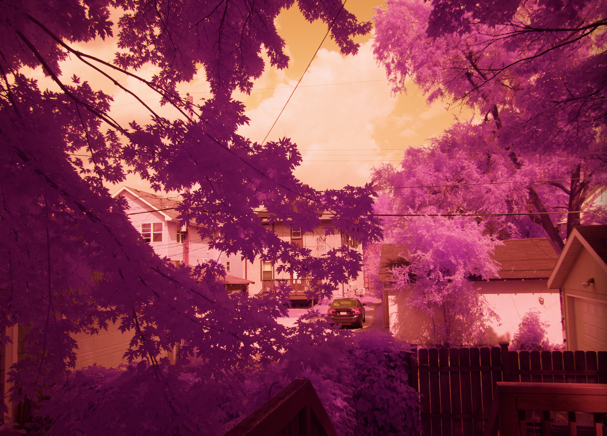
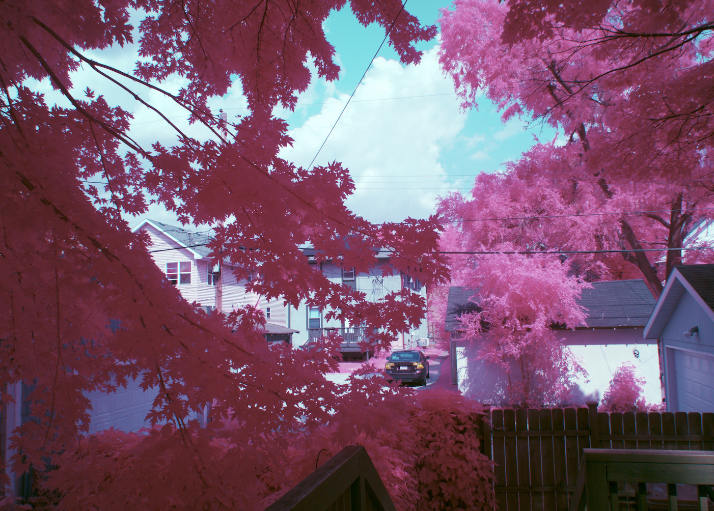
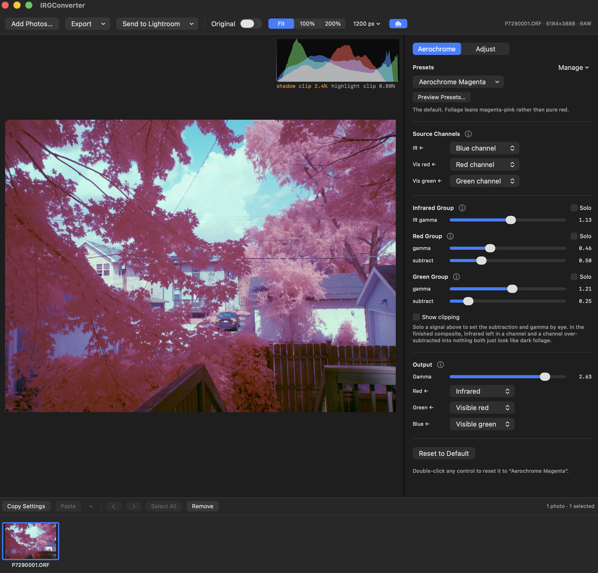

# IRGConverter

**Version 1.1.0** · macOS 14+ · [Changelog](CHANGELOG.md)

Native macOS app that converts (I)nfrared - (R)ed - (G)reen photographs to the
false-color look of **Kodak Aerochrome**. SwiftUI and Accelerate, entirely
on-device, no dependencies.

- [Overview](#overview)
- [Equipment](#equipment)
- [Shooting tips](#shooting-tips)
- [Features](#features)
- [Installation](#installation)
- [Usage](#usage)
- [Lightroom plugin](#lightroom-plugin)
- [Command line](#command-line)
- [Algorithm](#algorithm)
- [License](#license)

---

## Overview

This app is to recreate the Aerochrome look with a Full-spectrum digital camera. Aerochrome is a long dead
Kodak film which I believe was originally used for military and survey purposes. It's a false color film where
the blue sensitive layer is replaced with an infrared sensitive layer. By adding a yellow filter (and UV filter)
to a full spectrum converted camera, we are essentially emulating the way Aerochrome captures light. With
some magic channel swapping which comes from this [JW Wong post](https://www.flickr.com/photos/jw_wong/4960099202/)
(and inspired by [this video](https://www.youtube.com/watch?v=v5KBQd_DkQw))
we can re-create Aerochrome, but without needing to spend [$250+](https://www.ebay.com/sch/i.html?_nkw=kodak+aerochrome+film&_sacat=0&_from=R40&_trksid=p2334524.m570.l1313&_odkw=kodak+aerochrome&_osacat=0) on a roll.

| Input (Digital IR) | Output (Aerochrome Simulation) |
|-------------------|-------------------------------|
|  |  |

The yellow filter blocks visible blue, so the blue photosites see infrared and almost
nothing else. The transform subtracts that infrared out of the visible channels, then
swaps the groups onto new outputs: infrared → red, visible red → green, visible green
→ blue.

---

## Equipment

A full-spectrum camera, a yellow filter to block blue light, and a UV filter. Check
the [IR Hotspot Database](https://kolarivision.com/lens-hotspot-list/) to avoid lenses
known to hotspot.

Other filters work too — the app just assumes yellow by default.

## Shooting tips

- Shoot at your lowest ISO since we're really working the color channels hard.
- Because of low ISO, be prepared to use a tripod.
- Shoot in bright sunlight, clouds may absorb too much IR light.
- Healthy vegetation will have the most striking effect.
- People's skin will look yellow, so don't expect flattering portraits.

---

## Features

- **Batch editing** — filmstrip, per-photo settings, copy/paste between photos, folder export.
- **Six presets** plus your own, and a **Preview Presets** sheet that renders them all as tiles of your photo.
- **Adjust tab** — exposure, contrast, tonal lifts, color, curves, sharpening.
- **Viewing aids** — solo one signal as grey, or mark clipped pixels.
- **RAW development** with measured defaults, re-done at full resolution on export.
- **16-bit pipeline** — decode, orientation, downscale and transform all keep the depth.
- **Send to Lightroom** — 16-bit TIFFs beside the originals, opened in Lightroom.
- **Lightroom Classic plugin** and a **command-line** converter.

---

## Installation

macOS 14+. Building also needs a Swift 5.9+ toolchain — Command Line Tools
(`xcode-select --install`) is enough, Xcode is not required.

Either way, move the app into **`/Applications`**: that is where the Lightroom plugin
looks first, and where Finder's *Open With* can find it.

### Option 1: Download

1. Download `IRGConverter.zip` from the [releases page](https://github.com/bnimam/IRGConverter/releases).
2. Unzip it. Inside are the app, the [Lightroom plugin](#lightroom-plugin) with its
   installer, this README, the changelog and the licence.
3. Move it in, clear the quarantine flag (the app is ad-hoc signed, not notarized, so
   Gatekeeper will otherwise refuse it), and open it:

   ```bash
   mv ~/Downloads/IRGConverter/IRGConverter.app /Applications/
   xattr -dr com.apple.quarantine /Applications/IRGConverter.app
   open /Applications/IRGConverter.app
   ```

### Option 2: Build from source

```bash
git clone https://github.com/bnimam/IRGConverter.git
cd IRGConverter
./build_app.sh
mv IRGConverter.app /Applications/
open /Applications/IRGConverter.app
```

A locally built bundle is never quarantined, so it needs no `xattr` step. `swift run`
runs it without installing. `./build_app.sh --zip` writes the release archive to
`dist/`; the version lives in `Sources/IRGConverterCore/Version.swift`.

To update an installed copy, quit the app first — macOS keeps the old executable
mapped until you do — then `rm -rf /Applications/IRGConverter.app` before the `mv`,
since `mv` will not overwrite an existing bundle.

---

## Usage



Open or drop files — they all land in the filmstrip. RAW is developed neutrally;
anything Core Graphics can decode is used as-is. Pick a preset, then adjust from
there. Every group heading has an **ⓘ** button explaining which way to move its
controls and how to tell they are wrong.

The top bar also holds the view controls: **Original** to compare against the source,
**Fit / 100% / 200%** zoom, the resolution the live preview is computed from, and a
button to hide the histogram. At 100% and 200% — one and two image pixels per screen
pixel — drag the photo to move around it, and the frame is rendered at native size
whatever the preview resolution says, since magnifying a downsampled proxy would show
proxy pixels rather than the photo's.

### The transform

| Control | Range | Notes |
|---|---|---|
| **Source Channels** | red / green / blue | Which channel holds each signal. Infrared defaults to **blue** — that is where a yellow-filtered camera puts it. |
| **IR gamma** | 0.1 … 10 | The curve on the infrared group. Strongest single control: it sets how red foliage goes. |
| **Red gamma / subtract** | 0.1 … 10 / 0 … 2 | The curve sits *above* the Subtract layer, so it shapes what survived. Raise subtract until soloed foliage is nearly black, then back off. |
| **Green gamma / subtract** | 0.1 … 10 / 0 … 2 | Here the curve sits *below* the Subtract layer, so it runs first. Subtract sets how magenta foliage is: higher is redder, lower pinker. |
| **Output gamma** | 0.25 … 4 | The final curve over the composite. Lower is denser. |
| **Output map** | per channel | Which signal drives each output channel. |

Gamma sliders use a logarithmic track. Double-click any control to reset it to the
last thing applied whole — a preset, a paste, or the default.

Red's subtract and gamma do the same job between them, so set them as a pair: full
analytic cancellation of the infrared would want a subtraction near 0.85, but the
default is 0.50 because the curve above it finishes the work.

### Presets

**Aerochrome Magenta** is the default — every photo starts on it. The rest are that
one with two or three numbers moved:

| Preset | What it changes |
|--------|-----------------|
| **Aerochrome Magenta** | *(the default)* pink foliage, cyan sky |
| **Aerochrome Red** | green subtraction 0.25 → 0.55: red foliage rather than pink |
| **Aerochrome Bold** | IR gamma → 1.55, red subtraction → 0.58: stronger separation |
| **Aerochrome Subtle** | IR gamma → 1.02, subtractions → 0.38 / 0.18: restrained |
| **Aerochrome Deep** | output gamma → 2.05 and a steeper curve: denser |
| **Pre-swapped IRG** | reads infrared from red, for files already in IRG order |

A preset is a literal set of numbers — applying one puts exactly those values on the
sliders. `IRGConverterCheck` renders all six on a foliage-and-sky fixture and asserts
each one moves the direction its notes claim.

**Preview Presets…** shows them as tiles of the photo you are working on, rendered
from the preview already in memory. Worth more than the names here: what a preset does
depends on the frame, since how much infrared a subtraction leaves behind is a
property of the vegetation, not of the numbers.

The preset menu keeps naming the preset a photo started from even after a slider
moves — a record of where the settings came from, not a claim they are untouched.

Your own presets are JSON in `~/Library/Application Support/IRGConverter/Presets`,
safe to hand-edit; missing fields fall back to defaults rather than failing the load.

### Batch editing

The panel edits **one** photo — the one with the bright border. Each photo owns its
settings; they move only when you copy and paste.

Selection follows Finder: click, ⌘-click, ⇧-click, ⌘\[ / ⌘\]. *Copy Settings* (⌘⇧C)
and *Paste* (⌘⇧V) work on the selection, and the ⌄ menu chooses what a paste carries —
the Aerochrome transform, the Adjust tab, RAW development — as three groups that
partition the settings exactly.

Thumbnails are converted, not raw. A dot means edited, a green tick exported, a red
badge failed.

*Export* converts the selection or the whole strip into a folder as
`<name>_aerochrome.heic`. **Nothing is overwritten** — a taken name gets `-2`, `-3`.
One photo at a time, since each one is re-developed at native size and the transform
keeps a stack of float planes while it works.

### Adjust tab

Everything here runs *after* the transform. Exposure, contrast, highlights, shadows,
whites, blacks, saturation, vibrance, warmth, tint; master and per-channel curves
(monotone cubic, so they cannot overshoot into banding or reversals); and sharpening.

**RAW Development** — neutral balance and −1 EV headroom by default. Both are
measured, not taste: on the sample frame they cut clipped red pixels from 9.6% to 0.8%
and raise agreement between the two recovered visible channels from 0.880 to 0.944. A
color temperature cannot substitute — cooling far enough to stop the clipping
squashes the channels together and loses the infrared channel entirely.

**Sharpening** is a luminance unsharp mask (amount, radius, threshold), applied last
so it amplifies the finished picture's edge contrast. It cannot shift hue, since the
detail signal it adds back is grey. Radius is in pixels **of the full-size file**, so
a downsampled preview cannot show it honestly: below a third of a pixel the render
skips it rather than exaggerating it. Judge sharpening at **Preview → Full**; export
always applies it.

### Viewing aids

**Solo** shows one signal on its own as grey, bypassing the output map and the Adjust
tab. With the red subtraction set correctly, soloed visible red looks like an ordinary
black-and-white photograph with the vegetation nearly black — grey foliage means too
little subtraction, flat black over a wide area means too much.

**Show clipping** paints crushed pixels blue and blown ones red.

Both are view-only: they cannot be saved into a preset or reach an export, and the
preview shows an orange banner while either is on.

### Export

**Save This Photo…** writes the full-resolution result; the other entries do the
selection or the whole strip. HEIC only, written from the 16-bit render rather than
the 8-bit preview one.

**Send to Lightroom** converts at full resolution, writes **16-bit TIFFs beside the
originals** and opens them in Lightroom's import. TIFF has no 10-bit mode, so 16 bits
it is — lossless, and what Lightroom wants from another editor. Written uncompressed:
measured on the sample frame, LZW actually *expands* 16-bit photographic data and
deflate saves a few percent for twenty times the write time.

---

## Lightroom plugin

A Lightroom **Classic** plugin in [`LightroomPlugin/`](LightroomPlugin/) does one
thing: sends the photos selected in Lightroom to IRGConverter.app. It passes the
**original file paths**, so the conversion starts from sensor data; the catalogue is
not written to and no rendition is exported. Coming back is the app's own *Send to
Lightroom*.

### Installing it

The plugin is in the release archive under `LightroomPlugin/`, and in the repository at
the same path. Nothing is compiled — it is Lua, so either copy is ready to install.

1. Put `IRGConverter.app` in `/Applications` if it is not there already (see
   [Installation](#installation)). That is the first place the plugin looks; anywhere
   else and you will have to set the path by hand in Lightroom's Plug-in Manager.
2. From the unzipped download (or a clone of the repository), run the installer. It
   copies the plugin into `~/Library/Application Support/Adobe/Lightroom/Modules` — no
   admin rights needed, and it survives Lightroom updates:

   ```bash
   ./LightroomPlugin/install.sh
   ```
3. Restart Lightroom Classic if it was open. **File > Plug-in Manager** should now
   list *IRGConverter*; if it does not, click **Add** and choose the folder the
   installer printed.

Then select photos and choose **Library > Plug-in Extras > Open in IRGConverter** (it
also appears under File > Plug-in Extras). Lightroom **Classic** only — the cloud
Lightroom has no plugin SDK of this kind.

Deeper integration is not possible: this transform subtracts one channel from another,
which nothing in Lightroom's Develop module can express, and there is no API for
injecting pixel processing into that pipeline.

**Lightroom is not installed on the machine this was written on, so the SDK
integration is unverified.** Everything else is covered by
[`test_plugin.lua`](LightroomPlugin/test_plugin.lua) with the SDK stubbed — the app
search order, collecting files from a selection, shell quoting, offline masters:

```bash
lua LightroomPlugin/test_plugin.lua /Applications/IRGConverter.app
```

---

## Command line

`irgconvert` converts one file without opening the app. It ships inside the bundle at
`IRGConverter.app/Contents/MacOS/irgconvert`, and reads the same presets folder as the
app.

```bash
irgconvert --input P7290001.ORF --output out.heic
irgconvert --input P7290001.ORF --output bold.heic --preset "Aerochrome Bold"
irgconvert --input P7290001.ORF --output punchy.heic --ir-gamma 1.5 --green-subtract 0.55
irgconvert --list-presets
```

| Option | |
|---|---|
| `--input` / `--output` | Source and destination. Always HEIC. |
| `--preset <name>` | Omitted, the default preset is used — the same starting point as the app. |
| `--ir-gamma` / `--red-gamma` / `--red-subtract` / `--green-gamma` / `--green-subtract` / `--output-gamma` | The six transform controls, in slider units. They override the preset's. |
| `--sharpen` / `--sharpen-radius` / `--sharpen-threshold` | Unsharp mask. Amount 0 is off. |
| `--ir-channel <r\|g\|b>` | Which source channel holds infrared. Default `b`. |
| `--headroom` / `--temperature` / `--tint` | RAW development. These beat the preset's. |
| `--version` / `--help` | |

---

## Algorithm

One transform, on normalized float planes through Accelerate (vDSP). A direct
transcription of a Photoshop layer workflow: isolate the three groups, subtract
infrared from two of them, curve each, then mix onto swapped outputs.

```
irSignal = ir ^ (1 / irGamma)                                             // blue group curves
redSig   = max(visRed - redSubtract * irSignal, 0) ^ (1 / redGamma)       // Subtract, then curves
greenSig = max(visGreen ^ (1 / greenGamma) - greenSubtract * irSignal, 0) // curves, then Subtract
out[c]   = signal[map[c]] ^ (1 / outputGamma)
```

Photoshop's Subtract clamps at zero and layer opacity scales the subtrahend, so
`base − opacity × blend` clamped at 0 is exact. Dragging the centre of a Curves
adjustment is a gamma move, so every curve is `v ^ (1 / gamma)`.

The **curve order** is the easy thing to get wrong: red's curve sits *above* its
Subtract layer and green's *below*, so red is curved after subtracting and green
before.

Bit depth matters more than it sounds. The infrared curve is typically around 2.2, and
`v ^ (1/2.2)` stretches the bottom of the range about five times, so an 8-bit decode
would put banding exactly where the look lives. Measured, the infrared output carries
19,361 distinct levels; before the load path was fixed to stay at 16 bits it carried
101.

Then the Adjust tab: tone and color in one fused pass, curves as one composed
256-entry table per channel, and the unsharp mask as two separable vImage convolutions
over a single luminance plane.

**Verifying it.** The vectorized pipeline is checked against a scalar transcription of
the equations above, plus odd widths and row padding, every built-in preset, the
viewing aids, the copy/paste groups, batch naming, both export formats (including a
bit-identical TIFF round trip) and sharpening (edge overshoot both ways, hue held,
threshold, tiny images, downscaled renders skipping the mask). It is an executable
rather than an XCTest target, so it runs on a bare Command Line Tools install:

```bash
swift run IRGConverterCheck
```

---

## License

[GNU Affero General Public License v3.0](LICENSE) — See `LICENSE` for the full text.
